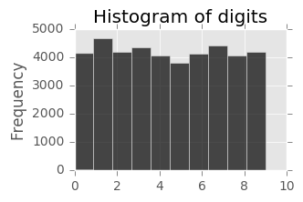
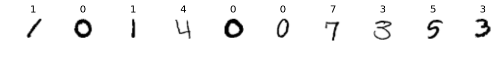
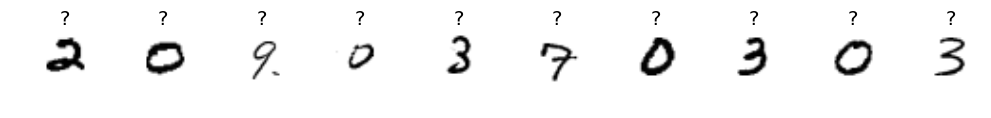
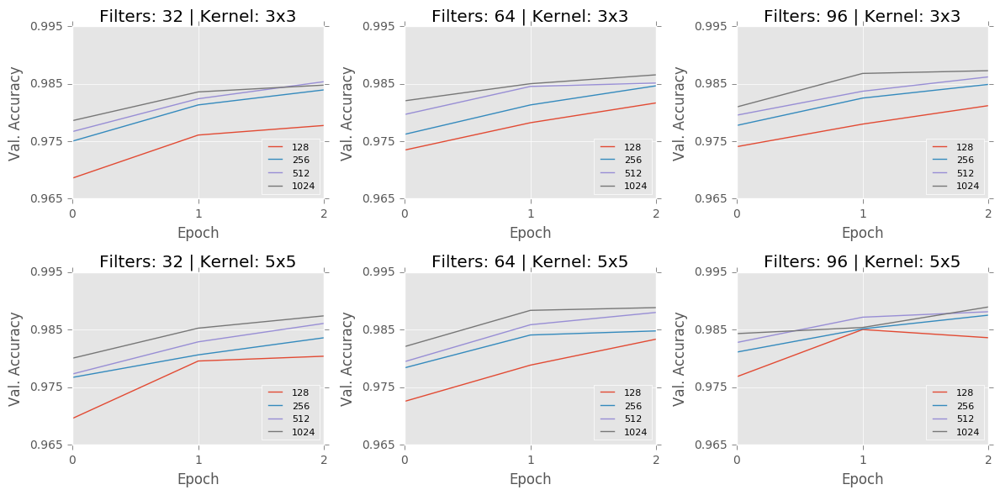
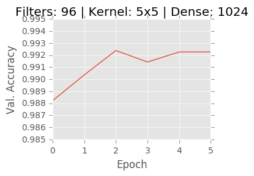
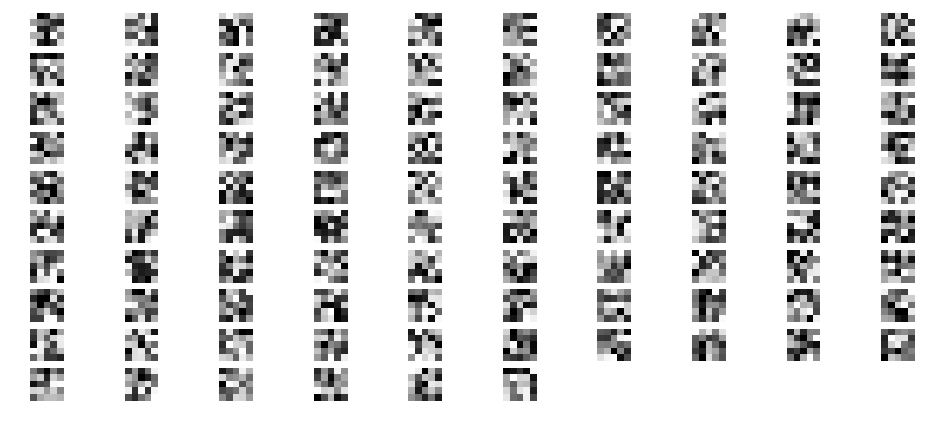
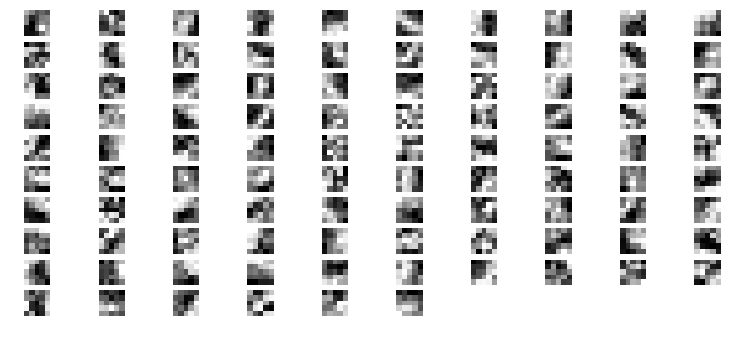
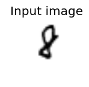
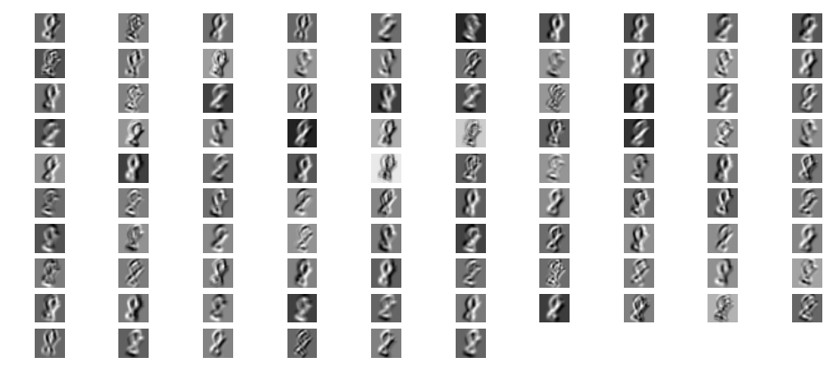
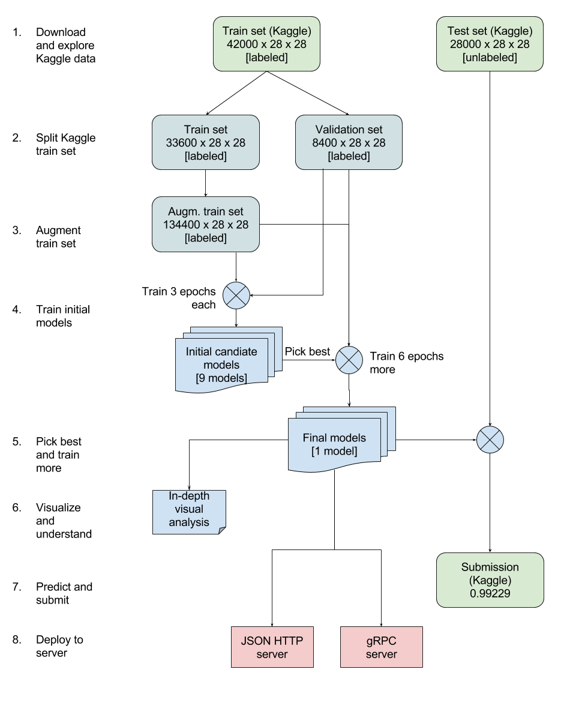

# Machine Learning Engineer Nanodegree
## Capstone Project
Dominic Breuker  
April 5th, 2017

## I. Definition

### Project Overview
Handwriting recognition has a long-standing history in machine learning research. During the 1980s, the first commercial tablet products have been released by companies such as Pencept, Linus and even Apple <sup>1</sup>. As a consequence, research interest in online handwriting recognition - the problem of recognizing characters as users write them with a pen - soared <sup>2</sup>. Online handwriting recognition provides a plethora of information beyond the mere writing you see on the device. Systems recorded a time sequence of coordinates as the pen was moved over the device. With such a rich signal, algorithms performed reasonably well to provide a decent user experience <sup>3</sup>.

A more challenging problem though is offline handwriting recognition. In the offline scenario, you only have access to an image of the written text. This constraint gives rise to considerable additional complexity. The first problem is that handwritten characters, compared to characters printed by machines, tend to be noisy and ambiguous. As this problem in itself is challenging enough, the famous MNIST dataset was created. It consists of a set images of handwritten digits and is a subset of the NIST database, a database of handwritten text <sup>4</sup>. It kept researchers busy for decades until human-level performance was achieved <sup>5</sup>. The second problem is that you typically do not get a single image per character but a scan of an entire document. Solutions to that problem include applying preprocessing techniques that segment text into lines, words and finally characters <sup>6</sup>, as well as training end-to-end neural networks with connectionist temporal classification layers <sup>7</sup>.

While neural networks and deep learning in particular yielded significant improvements, offline handwriting recognition remains a challenge today. Research communities organize competitions to improve the techniques <sup>8</sup> and startups a created that aim to provide commercial products in this field <sup>9</sup>.

### Problem Statement
My goal for this project is to build a classifier for the MNIST dataset built with a convolutional neural network. That is, I focus on the first of the two challenges in offline handwriting recognition as described in the previous section. The classifier will be able to take an image of a handwritten digit from 0 to 9 as input and output the correct class. For the project, I will use the dataset from the Kaggle competition on MNIST and will benchmark myself against the Kaggle leaderboard <sup>10</sup>. Kaggle prescribes the use of accuracy as the performance measure for this competition, which I will adopt for this reason.

I will put particular emphasis on the following deliverables:
- The classifier will be based on a deep learning neural network architecture and should perform close to the best solutions on Kaggle. Baselines lie at 0.96829 accuracy for random forests 0.96557 for KNN. I aim to be considerably better than that. Best scores on the leaderboard are 1.0. Since the dataset is publicly available, it is very likely that these submissions are based on cheating. On the leaderboard, there is an indicator named "Something fishy is going on if you ..." at accuracy 0.99514 to indicate the score above which people likely cheat. There are 81 submissions above that level. I consider my model a success if I get into the Top100 below this bar. **Hence, I aim for a score at least as good as that of submission 181, which is 0.99229 at the time of writing.**
- Visualizations can greatly facilitate understanding of convolutional neural networks <sup>11</sup>. To develop better understanding, I want to provide several visualizations that illustrate the inner workings and the effects of the models. I will provide three kinds of visualizations. First, **I will plot the weights of the first convolutional layer of my model.** Clear visual structures without any noise will indicate that the model converged properly <sup>12</sup>. Second, **I will visualize the activations of my layers after training.** They should be sparse and also exhibit clear structure if learning worked well <sup>12</sup>. Finally, **I will investigate in detail the examples that my model cannot classify correctly** to identify challenging features and opportunities for further improvements.
- Deep learning models are useful only if you can bring them from a research environment into production. Therefore, **I will build a microservice that enables me to deploy my model into the cloud.** It will allow to submit images via a simple JSON API that returns the models prediction. Using Docker, I will package all dependencies, so that DevOps engineers would have an easy time deploying the model to a company's environment.


### Metrics
I will use classification accuracy to measure the performance of my model for this project. Accuracy is measured as the fraction of examples for which the model predicts the correct class label. Class labels range from 0 to 9 - one for each digit. For example, if there are 100 example images and the model correctly predicts the class label for 85 of these, accuracy will be `85 / 100 = 0.85`. The best possibly achievable accuracy is 1.0. The worst accuracy possible is 0.0. As there are 10 classes, random guessing of the class label should result in an accuracy of about 0.1. Thus, any model should at least beat accuracy 0.1.

As the problem is framed as a multi-class classification problem, not many alternatives to accuracy exist <sup>13</sup>. For example, Cohen's Kappa could be used instead to measure how much better the classifier is compared to random guessing. For problems in which random guessing would already produce high accuracies, Cohen's Kappa can avoid to mistakenly get too excited about classification performance. For the given problem though, random guessing accuracy (0.1) is considerably lower than what we aim for (> 0.99). Moreover, the Kaggle leaderboard evaluates accuracy, which is another reason to adopt this measure.

## II. Analysis

### Data Exploration
Data from Kaggle comes conveniently in form of two CSV files, one for training and the other for testing <sup>10</sup>. In the training dataset, there are 42.000 rows and 785 columns. Each row corresponds to one example digit. The first column is the class label (0-9), the remaining 784 columns are pixel values (0-255) of the `28 * 28 = 784` images of the corresponding handwritten digit. The test set contains 28.000 rows and 784 columns. For the test set, all `28 * 28 = 784` columns are pixel values (0-255) of the image. There is no class label available.

Note that the Kaggle MNIST dataset is different from the typical dataset used in the literature. Typically, the 70.000 images are split into a training set of 60.000 images and a test set of 10.000 images (e.g., in <sup>14</sup>). Thus, the MNIST problem on Kaggle is slightly harder than in the literature. A comparison of performance to models from the literature would be misleading.

The class labels for the training dataset are evenly distributed. As you can see from the histogram below in Fig. 1, each of the 10 digits has approximately the same number of occurrences. Ass classification algorithms typically suffer from class imbalance, countermeasures would otherwise have been necessary.



*Fig. 1.: Class labels and the number of times they occur in the training dataset*

The dataset is very high quality needs no special cleaning. There are no missing class labels and obviously all pixel values are available for each image, i.e., no parts of images are occluded. Based on an initial screening, it is hard to assess if there are any outliers in the data (there could, e.g., be images that are not digit but letters, wrong class labels, ...). Due to the data's nature, you cannot identify outliers upfront. Instead, I will screen wrongly classified validation set images manually after building a classification model to keep the effort manageable. If there were any images that are outliers, they would likely be classified wrongly and show up in that screening.

### Exploratory Visualization

Below in figures 2 and 3, you can see visualizations of exemplary images from the training data (Fig. 2) and testing data (Fig. 3). For the training data, class labels are plotted above the images. All class labels in figure 2 seem to be correct as they correspond to images that I would have labelled the same way.



*Fig. 2.: Examples images from the training set - class labels are shown above the images*

The images themselves show some diversity regarding the exact positioning of the digit in the image. For instance, the digit `1` in figure 2 is more in the upper part of the image, whereas the digit `7` in figure 2 is much lower. This variability is expected since no cropping technique will extract images exactly. Building a classifier that can handle spatial translation will result in better performance when used in an end-to-end use case.

There is also diversity in the size of the digits. For instance, the `0` in the 4th position of figure 3 is rather small, whereas the `0` in the 2nd position of figure 3 is much larger. Also the thickness of the strokes varies a lot, as seen as well when comparing these two images. Some digits are also rotated. For instance, the first `1` in figure 2 is rotated clockwise ~45°, while the 2nd `1` in that figure is not. All this variability is also expected. Different writers have different styles of writing, use different pens, etc., which will create different images.



*Fig. 3.: Examples images from the test set - class labels are unknown*

To summarize, there is diversity due to imperfect cropping and different handwriting styles. Both are unavoidable and the classifier should be able to handle it. To improve performance, I will apply preprocessing techniques that amplify such diversity in the training data (cf. section III, Data Preprocessing).

### Algorithms and Techniques

As discussed before, I will use convolutional neural networks to model the problem. My architecture follows the example from LeCun 1998 <sup>14</sup> (with some modifications) and consists of four types of layers:
- *convolutional layers*: These layers can be interpreted as sets of filters sliding over images to detect relevant patterns. Each filter has a receptive field (say, a square of 5x5 pixels). Within this field, the layer behaves like an ordinary dense layer. The difference is that the same weights apply to many different fields. As an effect, a convolutional layer looks for the same patterns anywhere in an image.
- *max-pooling*: These layers are used to aggregate outputs of other layers. Like convolutional layers, they have a receptive field. Within that field though, these layers do not behave apply a linear transformation. Instead, they apply an aggregation function. For max-pooling, that function is `max`. It will therefore output the maximum value within its field, discarding the other values.
- *dropout*: These regularization layers are used to prevent overfitting. During training, a dropout layer will suppress activations of a randomly selected portion of nodes. This forces the network to use the remaining nodes for classification <sup>19</sup>.
- *dense classification layers*: These layers apply a linear transformation to the entire output of their previous layers, followed by a non-linearity (I will use the popular ReLU non-linearity). In the final dense layer, the output is fed into a softmax loss function.

The entire architecture of my model looks as follows:
```python
def build_model(num_filters, kernel_size, pool_size, dense_size):
    model = Sequential()
    model.add(Convolution2D(num_filters, kernel_size[0], kernel_size[1],
                            border_mode='valid',
                            input_shape=input_shape))
    model.add(Activation('relu'))
    model.add(Convolution2D(num_filters, kernel_size[0], kernel_size[1]))
    model.add(Activation('relu'))
    model.add(MaxPooling2D(pool_size=pool_size))
    model.add(Dropout(0.25))

    model.add(Flatten())
    model.add(Dense(dense_size))
    model.add(Activation('relu'))
    model.add(Dropout(0.5))
    model.add(Dense(num_classes))
    model.add(Activation('softmax'))

    model.compile(loss='categorical_crossentropy',
                  optimizer='adadelta',
                  metrics=['accuracy'])
```

The architecture loosely follows the architecture of LeCun 1998 <sup>14</sup>. I use two convolutional layers, followed by max-pooling, followed by two dense layers. I use ReLUs as non-linearities, dropout at various levels to avoid overfitting and softmax loss since we do classification.

One difference to LeCun 1998 <sup>14</sup> is the use of ReLUs. These non-linearities did not exist at the time but are very popular nowadays. Thus, I chose them for this project. Another difference is dropout, which I use as a regularization strategy. Notice that I did not specify any L1 or L2 regularizers. I found dropout to be sufficient already during my initial experiments.

As an optimizer, I chose ADADELTA, which has been successfully applied for MNIST in the literature <sup>17</sup>. When applying neural networks, it is often cumbersome to tune the learning rate to the problem at hand. If configured too high, the model will not converge to a local optimum. If set too low, it will converge very slowly. Many techniques have been developed to dynamically adjust the learning rate during training (e.g., Momentum <sup>15</sup> or ADAGRAD <sup>16</sup>). Using an approximation of the Hessian that can be computed efficiently (i.e., doubling compute time compared to vanilla SGD), the ADADELTA method can adjust learning rates automatically. Compare the technical report for details <sup>17</sup>. The Keras documentation recommends to not change ADADELTA's parameters, which is why I left them at their defaults <sup>18</sup>.

### Benchmark

MNIST has been studied extensively in the literature, which is why plenty of benchmarks are available <sup>5</sup>. As discussed before though, the dataset from Kaggle has a smaller training set and a larger test set as compared to the literature. Thus, I defined my benchmark in section "Problem Definition" above relative to the Kaggle leaderboard. I will optimize my model until I achieve a score of 0.99229, which means being in the Top100 on the leaderboard below the score at which Kaggle officials suspect cheating.

## III. Methodology

### Data Preprocessing

As discussed before, the data is generally in very good shape and needs little preprocessing. However, I have identified several sources of diversity in my exploratory data analysis. The exact position, size, thickness and alignment of the digits is different from image to image. As the whole purpose of my model is to handle this diversity, I apply data augmentation techniques to amplify this diversity in the training data. In particular, I generate three new images per image in the training dataset by applying the following augmentations:
- *Zoom*: I choose a random zoom factor uniformly between [0.95, 1.05] and scale the image accordingly.
- *Shift*: I choose both a horizontal and vertical a random shift factor uniformly between [-0.25, 0.25] and shift the image accordingly.
- *Rotation*: I choose a random rotation degree uniformly between [-45, 45] and rotate the image accordingly.

Before applying the augmentation, I split the Kaggle training data further into a training and a validation set. I used `33600` images for training and `8400` for validation, i.e., parameter tuning. After applying augmetation, I therefore had `33600 * 4 = 134400` training images.

### Implementation

You can find the source code for this project here: [https://github.com/DominicBreuker/mnist_neural_network](https://github.com/DominicBreuker/mnist_neural_network).
My implementation consists broadly of three parts:
- Development: This is the main part of the project in which I developed, refined and evaluated the classifier.
- HTTP-Server: This is a simple JSON API loading the neural network, accepting images via HTTP, and returning the predictions in the response body.
- gRPC-Server: This is a more sophisticated gRPC server based on TensorFlow Serving <sup>21</sup>, which loads a model exported for use in TensorFlow. Like the HTTP-Server, it accepts images and returns predictions, but it is considerably harder to write a client.

Both the development and the two production environments are containerized using Docker. As an effect, the only dependency for running my code is Docker <sup>20</sup>. In folder `/bin` you can find several scripts that show how to build Docker images and start Docker containers for the various parts of my implementation. Any developer who want's to work on my code can easily get started. Bringing the servers into production is very easy as well, e.g., using modern container runtimes such as Kubernetes <sup>22</sup>.

For development, I used Keras <sup>32</sup> as the main tool for building neural networks. Keras is a high-level abstraction on top of lower-level libraries such as Theano <sup>23</sup> or TensorFlow <sup>24</sup>. If you rely only on commonly available layers, developing in Keras will be easy and fast. Thus, it seemed most appropriate for my project. Besides Keras, I've also used Jupyter notebooks, pandas, matplotlib and other common Python libraries.

The biggest challenge during development was that training models took a long time on my laptop. I had to split my training sessions into several blocks of time, running it over night and using my laptop at daytime for other things. I therefore wrote disk caching functions to save intermediate results and keep going from where I stopped before.

For the HTTP-based production server, I chose Flask <sup>25</sup>, a Python-based microframework, as my main technology. It is perfect for building small web APIs fast. While I initially used Hug <sup>26</sup> (a dedicated API framework, even simpler to use) I switched to Flask for it's Python 2 support. The gRPC-Server runs TensorFlow Serving

The biggest challenge with the HTTP-Server was to support multi-threading. In development, Flask will start two threads to support faster reload. In production, Flask can and should be run multi-threaded. Loading a huge neural network multiple times though is very inefficient. Hence, I saved the model into a global variable and wrapped the prediction into a TensorFlow graph context block to make it use this graph.

For the gRPC-Server, I used TensorFlow Serving as the main tool. Written as a dedicated tool for productionizing deep learning models, it allows high performance access to predictions. If you run at scale, it will be considerably more cost-efficient as compared to the simple HTTP-based solution. However, it is also considerably more complicated to use since implementing clients is not as straightforward as writing an HTTP-JSON client.

The main obstacle in creating the gRPC server is exporting the Keras model to a TensorFlow-compatible format. I wrote an exporting script for it which is run as part of `bin/deploy_tensorflow_serving.sh`. It fetches the session from Keras and uses it with a TensorFlow model exporter to save the model. Check out `/notebooks/exporter.py` for details.

### Refinement

It is important to keep feedback cycles reasonably small during model development. Once the time to train a model and receive feedback on its performance exceeds several days or weeks, it will be hard to work towards a target since too many experiments run in parallel. Hence, the main constraint for model refinement is the time it takes to experiment with different model parameter configurations.

To keep effort manageable, I time-boxed my refinement phase in the following way. The available hardware for this project was my laptop and it was available in the evening hours and over night, but required at daytime for different purposes. The experiments for refinement should not exceed 5 days. In these 5 days, experiments would run over night and visualized to allow for comparisons. After these 5 days, the most promising model would be chosen from all the models compared so far. During a final training session in night 6, this model would be trained further to ensure it converged. At the end of the week, the laptop shall rest for one night.

To summarize, I chose the following strategy to refine my model:
1. I defined a parameter configuration space and incrementally chose configurations to be tested from them.
2. I performed short initial training on each of these configurations and visualized all results side by side.
3. I compared the results after 5 nights of training sessions/
4. I trained the best of the models for another night.

There were 3 parameters to be varied during training:
1. Number of filters: The number of filters of the convolutional layers. I tried values in range [32, 96].
2. Kernel size: The size of the window the convolutional layers slide over their previous layers. I compared sizes 3x3 and 5x5.
3. Nodes in dense layer: The number of nodes in the dense layer. I tried balues in range [128, 1024].

In figure 4 below, you can see the end results of the initial training session. The figure was updated frequently as I tried more configurations. I started out with rather small values and incrementally increased model complexity as I noticed it increased performance on validation data. I also made sure to systematically explore the configuration space to see in more detail how configurations influence performance.



*Fig. 4.: Comparison of different parameter configurations - Training for 3 epochs*

The most important thing to note is that these results suggest more complex models tend to increase performance. No matter what configuration parameter is increased, it slightly increases the performance after 3 epochs.

Looking at the accuracy values, it is also evident that they all are far below my target accuracy of 0.99229. The highest accuracy during the initial phase was 0.9889, and it was achieved for the most complex model with 96 filters, a 5x5 kernel size and 1024 nodes in the dense layer. This is not a big problem though since 3 epochs are not enough to make the model converge. Only after final training I could see if the model was able to meet the target.

After choosing the best performing model as the final model, I trained the model for additional 6 epochs. Validation accuracies for this training session can be seen in figure 5 below. We can see that performance increased during the first 3 epochs to about 0.9925. For the following 3 epochs, it stagnated at this level. This suggests the model finally converged and further training would not improve its performance.



*Fig. 5.: Validation accuracy for final model - Training for 6 more epochs*

Applying the trained final model to the test dataset and submitting to Kaggle, it delivered an accuracy of 0.99229 - exactly the target accuracy. Hence, I consider the solution acceptable for this project. Nevertheless, since we do not see any performance decrease with increased model complexity in figure 4, any further increase of model complexity could and likely would further increase performance. However, I decided against further improvements for this project.

## IV. Results

### Model Evaluation and Validation

As described in the previous section, the final model accuracy on the Kaggle test data is 0.99229. As this result scores within the Top100 in the leaderboard, I consider the accuracy target met for this project. Below, I will focus on analyzing the properties of the final model in greater detail.

An interesting aspect to look at are the filters learned by the convolutional layers. For the first convolutional layer, it is particularly easy to do so, since plotting model weights immediately delivers an interpretable representation. For deeper convolutional layers, specialized deconvolutional techniques would have to be applied which project activations back into the pixel space of the input images <sup>27</sup>. For this project, I focus only on first layer visualizations though.

before training | after training
:--------:|:-------
 | 

*Fig. 6.: Visualization of the filters in the first convolutional layer*

In figure 6, you can see all 96 filters of the first convolutional layer visualized by plotting their weights (5x5 kernel size). On the left, you can see the weights immediately after initialization. As expected, they look mostly random as the initialization assigns randomly using Glorot initialization <sup>28</sup>. On the right, you can see the weights after full training, i.e., after 9 epochs. Comparing to the weights before training, you can see the clear structures now visible in the kernel windows. Only very few filters still appear to be random. Most of them look like edges with a certain angle or curvature, others look like dots.

Another visualization can be found in figure 7. On the left, you can see an exemplary input image. On the right, you can find the activations of the feature map directly after the first convolutional layer. Comparing these to the filters of figure 6, you can clearly see correspondences. For instance, look at the filter in row 1 and column 5 of figure 6. It activates for horizontal edges in the upper part of the kernel window. Correspondingly, the activations in the feature map show greatest activity for the horizontal edges of the 8. More correspondences like this can be found.

input image | activations
:--------:|:-------
 | 

*Fig. 7.: Visualization of the activations in the feature map after the first convolutional layer*

Visualizations like these do not only strengthen my confidence in the model but can also be used to explain the inner workings of neural networks to decision makers. In a business context, it is not only important to create well-performing prediction models, but also to build an understanding of how they work and what they do. If you fail to do so, you risk that decision makers will not trust the model and discard their use <sup>29</sup>.

Finally, I present a visualization of all images in the validation set that the model failed to classify correctly. They can be found in figure 8 below. Above each image, you can see the true label. By analyzing the mistakes, we can better understand the shortcomings of the current model and generate ideas for further improvements.


*Fig. 8.: Complete list of falsely classified images in the validation dataset*

From a first look, you can see that there are a number of very challenging images in this list. I expect that even a human classifier would assign wrong labels to a significant number of images. For instance, consider the image in row 1 and column 4. While it actually is a 3, it looks indeed a lot like a 5. Achieving 100% accuracy is therefore actually very unlikely. This analysis confirms the choice from Kaggle to not trust these kinds of submissions.

Regarding how to further improve results, we can see that many of the images in figure 8 have strokes that are either very thick or very thin. Since I did not apply thinning (or thicking) algorithms in the preprocessing phase, I suspect that doing so could increase the model's robustness against these kinds of image features. Apart from the 6 in row 4, column 1, you do not find any image that is obviously misclassified due to rotation. This indicates that applying the preprocessing regarding this aspect was effective.

### Justification

As written above, I consider my leaderboard score acceptable for this project. Comparing it to the Kaggle benchmark, which is 0.96557 accuracy for a KNN classifier, the result is also significantly better.

To show the improvement statistically, I apply a t-test <sup>30</sup> to compare the accuracies on the test data. This test compares the means of two datasets and can tell you if there is a significant difference between the two. To perform the test, you need for each dataset the mean, the standard deviation, and the size. The test will deliver a p-value which, if small (e.g., < 0.05), will prove that the difference in the means is significant.

The accuracy of a classifier is the mean of the dataset that contains a 0 for wrong predictions and a 1 for correct predictions. There are exactly 42000 entries in each of the dataset as they were both computed on the 42000 test images. As we know the datasets can only contain 0s or 1s, we can deduce the standard deviations from the means and the sizes. For the KNN benchmark classifier, we have a mean of 0.96557, which results in a standard deviation of about 0.18239 (to check that, calculate the standard deviation of a dataset with 40553 1s and 1447 0s). Accordingly, my final model's mean is 0.99229, giving a standard deviation of about 0.08749. Applying these numbers to a t-test, it outputs a p-values < 0.0001, showing that the improvement is indeed statistically significant.

In terms of practical applicability, I also consider the result a success. With almost all digits properly identified, you could apply the model with great confidence in a handwriting recognition system. To catch the remaining errors, you could build higher level sanity checks into the recognizer, either to nudge classifiers toward certain digits or to flag digits for manual review (if possible). Several options are available:
- Domain-specific: depending on the application area, you could find certain rules that apply to numbers. For instance, if you parse prices of products, $9.99$ is a lot more likely that $9.69.
- General: Certain rules about the statistical distribution of digits in numbers hold throughout many application domains. For instance, consider Benford's law <sup>31</sup>, stating that the leading digit of any naturally occurring number is likely small.

## V. Conclusion

### Free-Form Visualization

My plan for this project was to go through a typical machine learning development process from the beginning to the end. In figure 9, I have summarized the process as I see it. It started with getting the data from Kaggle and exploring it to make sure it is clean. I went on splitting the training data into train and validation sets to be able to compare different classifiers against each other. Before training classifiers though, I have further augmented the data in ways that simulate dirty handwriting to ensure my classifiers are as robust as possible. To compare models, I've trained models initially only for few epochs, assuming that their relative validation accuracies after short training are indicative for what they would be at convergence. After selecting the best of the candidate models, I trained that model until I was sure it converged. Visualizing its properties fostered my confidence in the model's quality and my understanding of convolutional neural networks in general. Applying the model to the test data and submitting to Kaggle, the model scored much better than the Kaggle benchmarks. More importantly, it met the performance goal I defined earlier. I went on implementing two servers that would allow to delpoy my models to a production environment. One server is easier to implement and integrate but will serve predictions inefficiently, the other is more efficient yet would require more integration effort.



*Fig. 9.: Visualization of the process applied in this project*

### Reflection

In this project, I successfully developed a classification model based on convolutional neural networks, visualized and analyzed it's properties, and built two versions of servers that would allow using the model in a companies production environment. The models scored within the Top100 on Kaggle's public leaderboard (after removing those submissions that Kaggle flags as likely involving cheating).

For me, the most interesting part of this project was creating and analyzing the visualizations I discussed in the section on model evaluation and validation. Convolutional neural networks sound like a very complicated topic when you read about them. Building them and then analyzing their properties made me more confident in explaining how and why they work.

The most challenging part was to work around limitations regarding computation times. While it is easy to pick up Keras by applying examples seen in code examples, programming proper model comparison and validation code that caches intermediate results turned out to be very important to make progress. Saving results in a structured form greatly facilitated my overview of the results up to the current point. If I would have followed my unstructured workflows from preliminary experimentation before this project, I would not have been able to write this report.

### Improvement

Improvements in many areas are conceivable:
- *Model performance:* my model comparison suggests more complex models would further increase performance. Improvements of accuracy are likely achievable by comparing more parameter configurations. I would do so until an increase in complexity would actually lead to overfitting, i.e., increasing training accuracy but decreasing validation accuracy. Moreover, the evaluation section revealed that misclassified images share certain features, most importantly very thick or very thin strokes. This suggests that further applying according preprocessing techniques to increase the prevalence of these features in the training data could improve performance.
- *Visualization and understanding:* I only visualized model weights of the first convolutional layers. With deconvolutional techniques, I would further extend this analysis to higher layers of the network to find out what images activate nodes in those layers. These visualizations would likely facilitate my understanding of convolutional neural networks considerably.
- *Implementation and deployment:* my servers for the final model are working and could be deployed easily, yet they are nothing more than proof of concept implementations. I see at least three possible areas of improvement. First, adding tests would be an obvious next step to keep the code maintainable. Second, more functionality (e.g., batch predictions) would make the servers more versatile. Third, client libraries should be created to allow other developers to easily integrate with the prediction model.

## References

<sup>1</sup>: Wikipedia - History of tablet computers [link](https://en.wikipedia.org/wiki/History_of_tablet_computers#1980s)

<sup>2</sup>: Tappert, Charles C., Ching Y. Suen, and Toru Wakahara. "The state of the art in online handwriting recognition." IEEE Transactions on pattern analysis and machine intelligence 12.8 (1990): 787-808.

<sup>3</sup>: Plamondon, Réjean, and Sargur N. Srihari. "Online and off-line handwriting recognition: a comprehensive survey." IEEE Transactions on pattern analysis and machine intelligence 22.1 (2000): 63-84.

<sup>4</sup>: NIST Special Database 19 [link](https://www.nist.gov/sites/default/files/documents/srd/nistsd19.pdf)

<sup>5</sup>: Wikipedia - MNIST [link](https://en.wikipedia.org/wiki/MNIST_database)

<sup>6</sup>: Marti, U-V., and Horst Bunke. "The IAM-database: an English sentence database for offline handwriting recognition." International Journal on Document Analysis and Recognition 5.1 (2002): 39-46.

<sup>7</sup>: Graves, Alex, and Jürgen Schmidhuber. "Offline handwriting recognition with multidimensional recurrent neural networks." Advances in neural information processing systems. 2009.

<sup>8</sup>: ICFHR2016 Competition on Handwritten Text Recognition on the READ Dataset [link](http://transcriptorium.eu/~htrcontest/)

<sup>9</sup>: SearchInk - A new layer to search [link](http://searchink.com/)

<sup>10</sup>: Kaggle competition - Digit Recognizer [link](https://www.kaggle.com/c/digit-recognizer)

<sup>11</sup>: Zeiler, Matthew D., and Rob Fergus. "Visualizing and understanding convolutional networks." European conference on computer vision. Springer International Publishing, 2014.

<sup>12</sup>: CS231n Convolutional Neural Networks for Visual Recognition [link](http://cs231n.github.io/understanding-cnn/)

<sup>13</sup>: scikit-learn classficiation metrics [link](http://scikit-learn.org/stable/modules/model_evaluation.html#classification-metrics)

<sup>14</sup>: LeCun, Yann, et al. "Gradient-based learning applied to document recognition." Proceedings of the IEEE 86.11 (1998): 2278-2324.

<sup>15</sup>: D. E. Rumelhart, G. E. Hinton, and D. E. Williams. "Learning representations by back-propagating errors." Nature 323.6088 (1986): 533-538.

<sup>16</sup>: Duchi, John, Elad Hazan, and Yoram Singer. "Adaptive subgradient methods for online learning and stochastic optimization." Journal of Machine Learning Research 12.Jul (2011): 2121-2159.

<sup>17</sup>: Zeiler, Matthew D. "ADADELTA: an adaptive learning rate method." arXiv preprint arXiv:1212.5701 (2012).

<sup>18</sup>: Keras documentation on ADADELTA [link](https://keras.io/optimizers/#adadelta)

<sup>19</sup>: Srivastava, Nitish, et al. "Dropout: a simple way to prevent neural networks from overfitting." Journal of Machine Learning Research 15.1 (2014): 1929-1958.

<sup>20</sup>: Docker home page: [link](https://www.docker.com/)

<sup>21</sup>: TensorFlow Serving homepage: [link](https://tensorflow.github.io/serving/)

<sup>22</sup>: Kubernetes homepage: [link](https://kubernetes.io/)

<sup>23</sup>: Theano homepage: [link](http://deeplearning.net/software/theano/)

<sup>24</sup>: TensorFlow homepage: [link](https://www.tensorflow.org/)

<sup>25</sup>: Flask homepage: [link](http://flask.pocoo.org/)

<sup>26</sup>: Hug homepage: [link](https://github.com/timothycrosley/hug)

<sup>27</sup>: Zeiler, Matthew D., and Rob Fergus. "Visualizing and understanding convolutional networks." European conference on computer vision. Springer International Publishing, 2014.

<sup>28</sup>: Glorot, Xavier, and Yoshua Bengio. "Understanding the difficulty of training deep feedforward neural networks." Aistats. Vol. 9. 2010.

<sup>29</sup>: Provost, Foster, and Tom Fawcett. Data Science for Business: What you need to know about data mining and data-analytic thinking. " O'Reilly Media, Inc.", 2013.

<sup>30</sup>: Wikipedia - Student's t-test [link](https://en.wikipedia.org/wiki/Student%27s_t-test)

<sup>31</sup>: Wikipedia - Benford's law [link](https://en.wikipedia.org/wiki/Benford%27s_law)

<sup>32</sup>: Keras homepage: [link](https://keras.io/)
